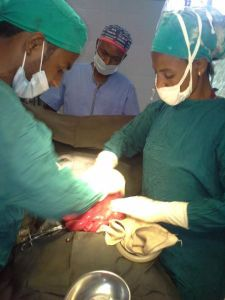

Welcome to the Professional Association of Emergency Surgery Officers of Ethiopia.

Integrated Emergency Surgical Officers are advanced associate clinicians who have completed a graduate degree (MSc) in integrated emergency general surgery, obstetrics and gynaecology (IEGSOG curriculum, 2009). Further information on the eligibility criteria and the curriculum are available on the website of Mekelle University of Health Sciences.

Surgical and obstetric emergencies are a major cause of death in Ethiopia. 
Maternal and infant mortality from perinatal complications remain unacceptably high. 
Road traffic collisions and other surgical emergencies also contribute to high death rates amongst the young and the old.

The Ethiopian Government and [Ministry of Health](http://www.moh.gov.et) recognised this huge problem and introduced the [Integrated Emergency Surgical Officer](http://www.moh.gov.et/en_GB/ieso) (IESO) programme in 2010 as one of the steps towards achieving some of the [Millennium Development Goals](http://www.un.org/millenniumgoals) set by the [United Nations](http://www.un.org).

IESOs are responsible for the diagnosis and management of emergency general surgical, obstetric and gynaecological emergencies as well as truama in resource-constrained health centres. Since they started a few years ago, they have been responsible for saving a huge number of lives and improving the mortality and morbidity associated with a child-birth as well other surgical emergencies.

Their role is not only limited to clinical activities but may also extend to include research, teaching, management and leadership roles. This website will provide regular updates on the evolution of the role of IESOs in Ethiopia as well as their impact on the health of the people they serve.

### Recent posts

<ul class="c-archives__list">

<li class="c-archives__item">

    <h3><a href="{{ post.url | prepend: site.baseurl }}">{{ post.title }}</a></h3>
    
{{ post.date | date: "%b %-d, %Y" }}

</li>

